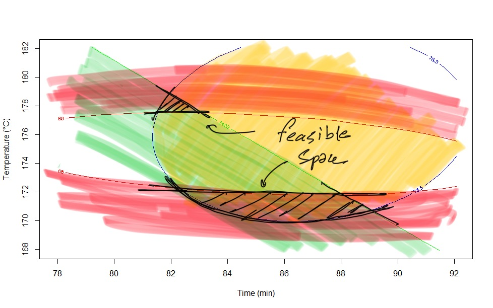

## Multiple Responses

In the modeling part, the Desirability Function is developed for the constrained optimization.

## The Desirability Function

  

| Response | Desired range |
| --- | --- |
| Y1 | Max Y1 |
| Y2 | 62 < Y2 < 68 |
| Y3 |  Y3 < 3400 |

| Time | Temperature |
| --- | --- |
| 85.30887 | 170.87462  |