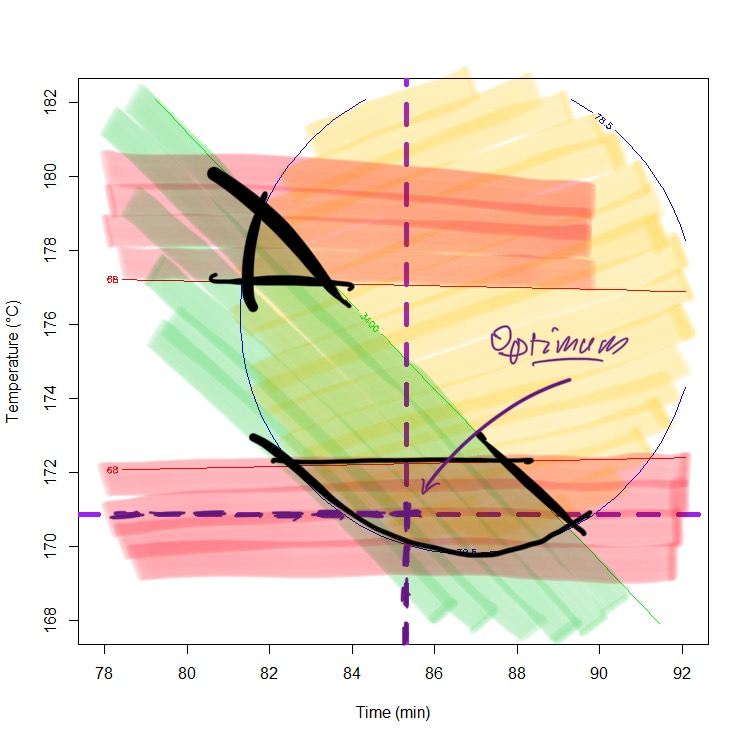

## The Overlayed Plots

  

## Multiple Responses
In the modeling part, the Desirability Function is developed. In this section constrained optimization used to find the maximum desirability.

| Response | Desired range |
| --- | --- |
| Y1 | Max Y1 |
| Y2 | 62 < Y2 < 68 |
| Y3 |  Y3 < 3400 |

## Optimization Results
Using optim package, the combination with the highest overall desirability is presented bellow.

| Time | Temperature |
| --- | --- |
| 85.30887 | 170.87462  |

