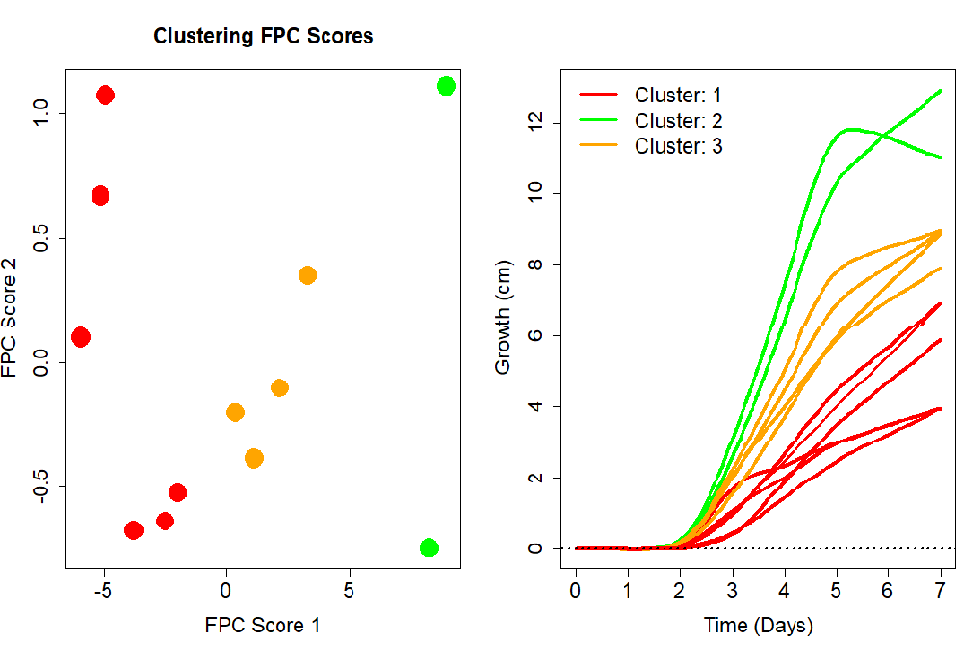

## The Growth Simulator App
A dynamical design space for plant growth was obtained
through functional data analysis (FDA) combined with design of experiments (DOE). Three factors (Substrate, light and Cress type) were investigated and the functional response was pre-processed, smoothed through B-spline  pproximation and subjected to functional principal component analysis (FPCA).  The scores of the FPCA were modelled as a function of the experimental factors through response surface models and used to build a final model for the functional response including only two principal components. The developed model was able to predict with good accuracy the functional responses as a function of the experimental factors and time and allowed to build a dynamical design space.

  

## The Cress Experiment
For additional information, you can refer to the link https://community.jmp.com/t5/JMP-Blog/Let-It-Grow-The-Garden-Cress-Challenge-Announcing-our-Winner/ba-p/549808

|       |       |          |       |
| -     | -     | -        | -     |
|Factor           |       | Levels   |       |
|                 |   Low  ||     High       |
|Substrate        |Soil    ||Cotton          |
|Light Condition  |Light   ||Dark            |
|Cress Type       |Plain   ||Curled          |

## Height curve as function of time for each pot

  

## Smoothing the Curves

  
The first step of fda analysis is to smooth the discrete curves. 
  

  

  

## Curve Decomposition and Reconstruction

  
Once the curve is smoothed it can be decomposed to its principle components. Like PCA, FPCA displays Functional Principal Components Analysis the dominant or modes of variation.
  

  

  

## Curve Clustering

  

  

  

  

