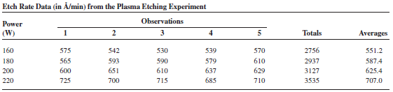
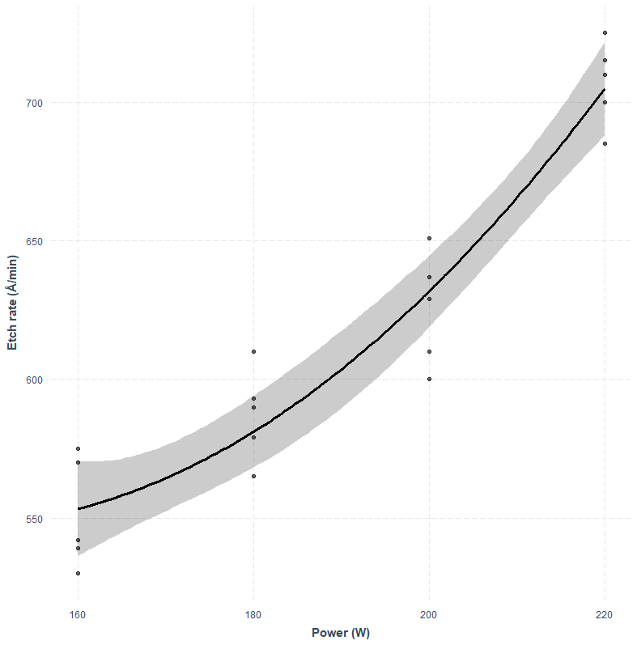

## Experiment

An Engineer is interested in investigating the relationship between the RF power setting and the etch rate for this tool. The objective of an experiment like this is to model the relationship between etch rate and RF power and to specify the power setting that will give a desired target etch rate.

  

  

