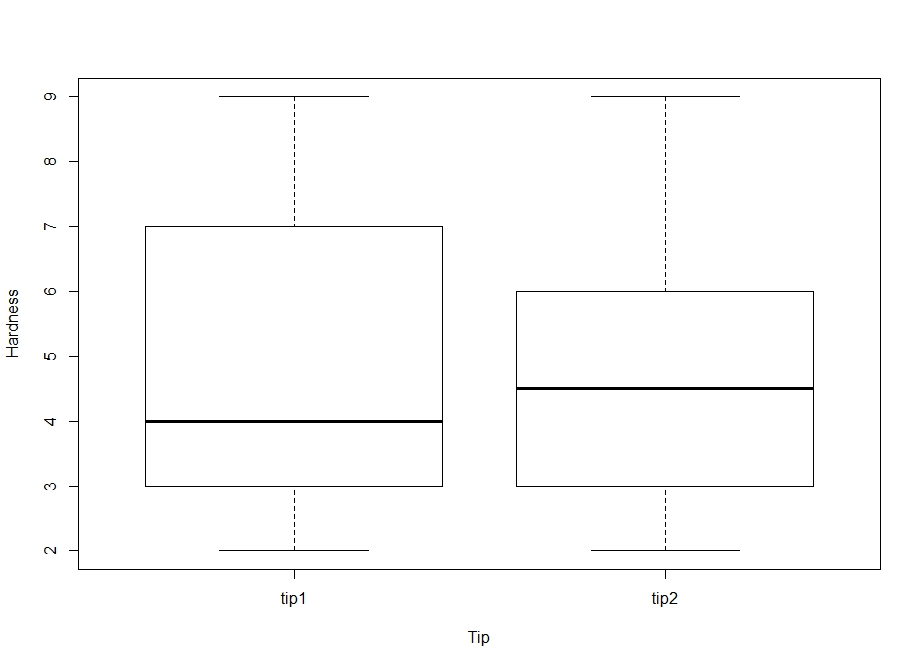

## Experiment Goal
For hardness testing machine two pressing elements (tips) are availables, the hardness is then determined based on the depth caused by the pressing element on the specimen.
In this study, the experimenter is  investigating whether the tips output different mean hardness readings.

*from Design and Analysis of Experiments Douglas C. Montgomery. part 1-John Wiley (2001)

## Paired test
A little reflection will reveal a serious disadvantage in the completely randomized design for this problem. Suppose the metal specimens were cut from different bar stock that were produced in different heats or that were not exactly homogeneous in some other way that might affect the hardness. This lack of homogeneity between specimens will contribute to the variability of the hardness measurements and will tend to inflate the experimental error, thus making a true difference between tips harder to detect. To protect against this possibility, consider an alternative experimental design. Assume that each specimen is large enough so that two hardness determinations may be made on it. This alternative design would consist of dividing each specimen into two parts, then randomly assigning one tip to one-half of each specimen and the other tip to the remaining half. The order in which the tips are tested for a particular specimen would also be randomly selected. The experiment, when performed according to this design with 10 specimens, produced the data shown.

