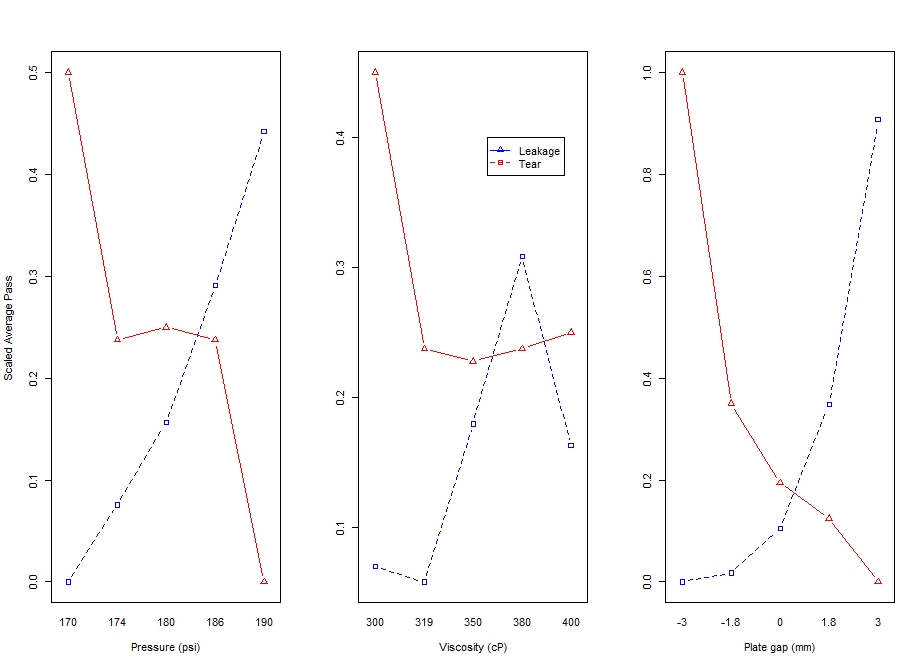
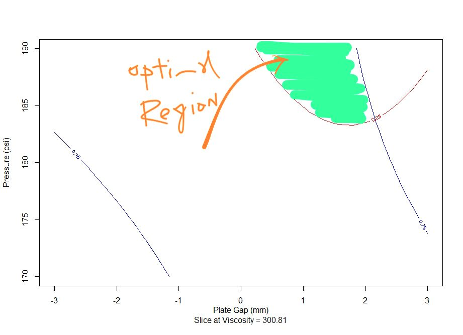
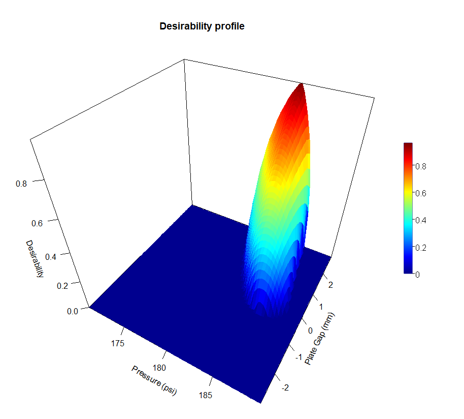

The goal of this experiment is to fit Response Surface Models to the two conflicting responses, Tear and Leakage, as a function of three controllable factors of the sealing process of the Starbucks coffee bag. These factors are Pressure (clamping pressure in psi) and the Plate gap (the space between the sealing jaws in mm) and finally Viscosity of the plastic in cP.

